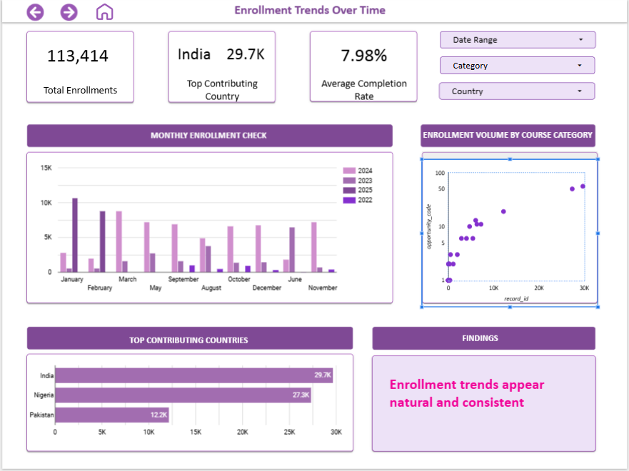
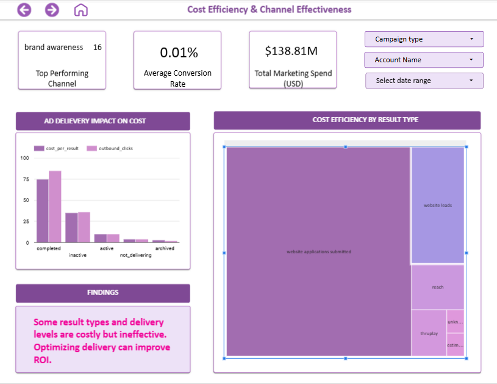
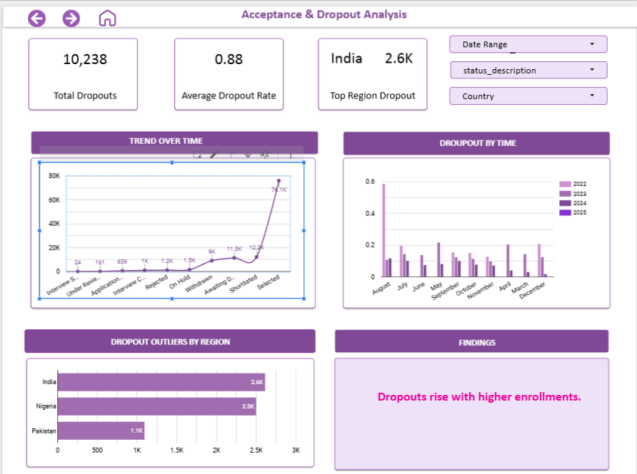

# 🎓 EduVision: Enrollment & Performance Insights Dashboard

> **Capstone Project | Excelerate Data Visualization Associate Internship (March 2025)**  
> Tools: **PostgreSQL, Supabase, Looker Studio, Excel**  
> Role: **KPI Design, Wireframe Planning, Dashboard Development, Team Coordination**

---

##  Table of Contents
- [Project Overview & Problem Statement](#project-overview--problem-statement)
- [Data Exploration & Preprocessing](#data-exploration--preprocessing)
- [Dashboard Structure & Features](#dashboard-structure--features)
- [My Role & Contributions](#my-role--contributions)
- [Challenges & Solutions](#challenges--solutions)
- [Learnings & Skill Development](#learnings--skill-development)
- [How to View the Dashboard](#how-to-view-the-dashboard)
- [Project Files](#project-files)
- [Acknowledgements](#acknowledgements)

---

  
  &nbsp;
  

  
  &nbsp;
  

## 📖 Project Overview & Problem Statement

**EduVision** is an interactive, multi-page dashboard designed to provide data-driven insights into enrollment patterns, learner performance, and marketing effectiveness for an educational platform. It was developed as the final deliverable during the Excelerate internship program.

### 💡 Problem Statement
Education organizations often struggle to:
- Track and analyze cohort performance and dropout rates.
- Identify trends in learner demographics.
- Measure marketing ROI and cost efficiency.

This dashboard addresses those gaps with live, structured, and interactive data insights.

---

##  Data Exploration & Preprocessing

- **Datasets Used**:
  - `Learner Data` – Demographics, enrollment & dropout info.
  - `Cohort Data` – Batches, regions, timelines.
  - `Marketing Data` – Campaign reach, cost, performance metrics.

- **Steps Taken**:
  - Cleaned and validated data in Excel.
  - Imported into PostgreSQL (via pgAdmin) with consistent datatypes.
  - Joined tables to create a Master Table using SQL queries.
  - Hosted database on **Supabase** for live Looker Studio connection.

---

## Dashboard Structure & Features

**Built using a multi-page layout for clarity & storytelling**  
Each page is structured around a core theme with argument-driven visualizations.

### Page 1: Enrollment & Dropout Trends
- Monthly enrollment patterns
- Dropout analysis by cohort

### Page 2: Learner Demographics & Performance
- Gender, age, region-based insights
- Top/Bottom performing cohorts

### Page 3: Marketing Campaign Analysis
- Campaign reach, delivery & cost metrics
- ROI by campaign & regional effectiveness

---

## My Role & Contributions
As a key contributor and **Project Supervisor** in the team:

- 🧩 **Defined KPIs** and planned overall layout using stakeholder-centric goals.
- 🗺️ Created wireframe that helped structure insights into clear, logical flows.
- 🔧 Cleaned, joined, and validated Master Table and Marketing Data.
- 📈 Developed full dashboard pages for Enrollment & Performance sections.
- 🧭 Played a central role in team **coordination**, task delegation, and communication.
- 📑 Designed user-friendly documentation to guide the team’s dashboard execution.

---

## Challenges & Solutions

| Challenge | Solution |
|----------|----------|
| Inactive team member in final stages | Stepped up to complete missing parts and led reallocation of work |
| Datatype mismatches during import | Used Excel preprocessing + manual pgAdmin table creation |
| Real-time collaboration issues | Migrated PostgreSQL to **Supabase** for seamless Looker Studio access |
| Insight overload in single-page view | Switched to **multi-page storytelling layout** to avoid clutter |

---

## Learnings & Skill Development

- 📊 **Dashboarding**: Developed a real-world, multi-page business dashboard.
- 🧠 **SQL Proficiency**: Practiced joins, cleaning, validation & derived metrics.
- ☁️ **Cloud Integration**: Used **Supabase + Looker Studio** for real-time sync.
- 🤝 **Team Collaboration**: Led team meetings, created guides, and resolved blockers.
- 🎯 **Insight Storytelling**: Applied data storytelling using trends, comparisons, and visual logic.

---

## 📁 Project Files

project_sql_queries.sql – Final merged and cleaned SQL table.

final_presentation_slide : Final group presentation slide.

wireframe_dashboard.pdf – Visual layout plan.

screenshots/ – Sample images of final dashboard.

README.md – Project documentation.

